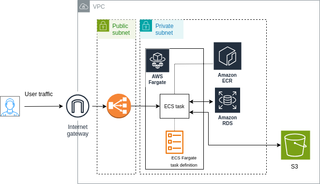

# WordPress on AWS with Terraform

This repository contains the Terraform code to deploy a WordPress site on AWS using ECS Fargate, RDS, and S3 for media storage.

## Table of Contents

- [Prerequisites](#prerequisites)
- [Installation](#installation)
- [Usage](#usage)
- [Configuration](#configuration)
- [Architecture](#architecture)

## Prerequisites

Before you begin, ensure you have the following installed on your local machine:

- [Terraform](https://www.terraform.io/downloads.html) v0.12+
- [AWS CLI](https://aws.amazon.com/cli/)
- [Docker](https://www.docker.com/products/docker-desktop) (for building the Docker image)
- [Git](https://git-scm.com/)

## Installation

1. Configure AWS CLI with your credentials:

    ```bash
    aws configure
    ```

2. Initialize Terraform:

    ```bash
    terraform init
    ```

## Usage

1. **Build and Push Docker Image:**

    Ensure your Docker image is built and pushed to ECR:

    ```bash
    # Build Docker image
    docker build -t wp .

    # Tag Docker image
    docker tag wp:latest <AWS-ACCOUNT-ID>.dkr.ecr.<AWS_REGION>.amazonaws.com/wp:latest

    # Push Docker image
    docker push <AWS-ACCOUNT-ID>.dkr.ecr.<AWS_REGION>.amazonaws.com/wp:latest
    ```

2. **Apply Terraform Configuration:**

    Provide necessary variables such as `db_password` via CLI or environment variables:

    ```bash
    terraform apply -var="db_password=your_secure_password"
    ```

    or

    ```bash
    export TF_VAR_db_password=your_secure_password
    terraform apply
    ```

## Configuration

Customize your deployment by modifying the variables in `variables.tf`:

- `db_username`: The database username
- `db_password`: The database password (required at runtime)
- `db_name`: The database name
- `s3_bucket_name`: The name of the S3 bucket for media storage
- `ecs_task_family`: The ECS task family name

## Architecture

The architecture includes the following AWS components:

- **ECS Fargate**: Running the WordPress Docker container
- **RDS**: MySQL database for WordPress
- **S3**: Bucket for storing media uploads


